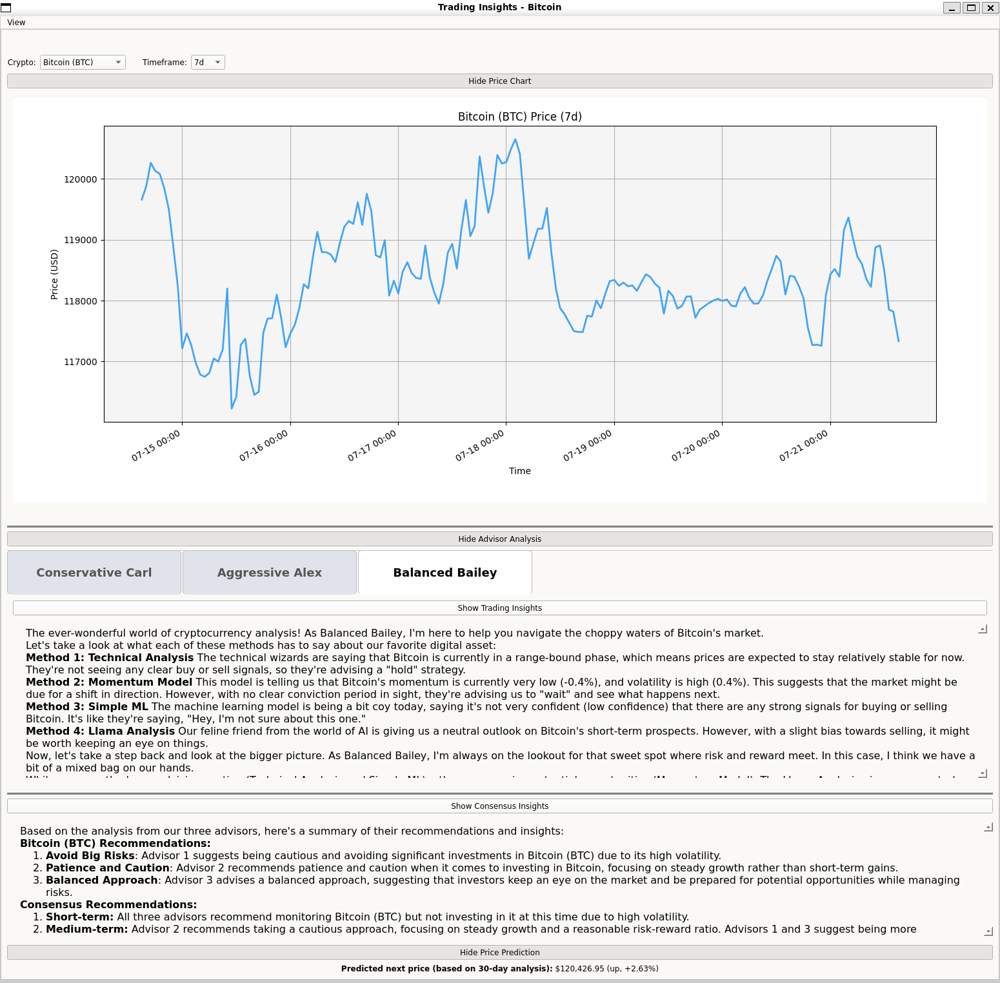

# Trading Insights

A comprehensive Python desktop application that provides AI-powered cryptocurrency analysis and trading insights across multiple analytical frameworks.



## 🚀 Features

### 📊 **Multi-Cryptocurrency Support**
- **Bitcoin (BTC)**, **Ethereum (ETH)**, **Dogecoin (DOGE)**, **Solana (SOL)**, **XRP**
- Real-time price data from CoinGecko API
- Historical data analysis with intelligent fallbacks

### 📈 **Advanced Price Visualization**
- Interactive price charts with multiple timeframes: **1h, 24h, 7d, 30d**
- Clean, modern PyQt5 GUI with off-white background for optimal readability
- Collapsible sections for focused analysis

### 🧠 **Four Distinct Analysis Methods**
1. **Technical Analysis** - Traditional RSI and Moving Average indicators
2. **Momentum Model** - Price velocity and acceleration analysis  
3. **Simple ML** - Statistical pattern recognition with feature scoring
4. **Llama Analysis** - AI-powered natural language price pattern analysis

### 👥 **AI-Powered Advisory System**
- **Conservative Carl** - Risk-averse, capital preservation focused
- **Aggressive Alex** - Growth-focused, high-reward seeking  
- **Balanced Bailey** - Moderate, well-rounded approach
- Each advisor analyzes **all four methods** for comprehensive insights

### ⚡ **Smart Features**
- **LLM Response Caching** - Improved performance with intelligent caching
- **Robust Error Handling** - Graceful fallbacks when APIs are unavailable
- **Collapsible UI Sections** - Focus on what matters to you
- **Asset-Aware Analysis** - All insights tailored to the selected cryptocurrency

## 🛠️ Setup

### Prerequisites
- **Python 3.8+** 
- **Ollama** (for AI analysis) - [Install Ollama](https://ollama.ai/)
- Run `ollama pull llama3.2` to download the required model

### Installation
1. **Clone the repository**
   ```bash
   git clone <repository-url>
   cd trading-insights
   ```

2. **Create and activate virtual environment**
   ```bash
   python3 -m venv venv
   source venv/bin/activate  # On Windows: venv\Scripts\activate
   ```

3. **Install dependencies**
   ```bash
   pip install -r requirements.txt
   ```

## 🚀 Running the App

1. **Ensure Ollama is running** (for AI analysis):
   ```bash
   ollama serve
   ```

2. **Activate virtual environment**:
   ```bash
   source venv/bin/activate  # On Windows: venv\Scripts\activate
   ```

3. **Launch the application**:
   ```bash
   python -m ui.main_window
   ```

The app will open with Bitcoin (BTC) selected by default. You can switch cryptocurrencies, adjust timeframes, and explore different advisory perspectives.

## 📱 How to Use

### **Cryptocurrency Selection**
- Use the **"Crypto"** dropdown to switch between Bitcoin, Ethereum, Dogecoin, Solana, and XRP
- Analysis automatically updates for the selected asset

### **Timeframe Analysis** 
- **Chart Display**: Select 1h, 24h, 7d, or 30d to zoom in/out on price movements
- **Insights Calculation**: Always uses the best available longer-term data (30d preferred) for stable analysis

### **Collapsible Sections**
- **Hide/Show Price Chart**: Focus on analysis without the visual chart
- **Hide/Show Advisor Analysis**: Each advisor tab shows their perspective
- **Hide/Show Consensus Insights**: Combined analysis from all advisors  
- **Hide/Show Price Prediction**: AI-powered price forecasting

### **Advisory System**
- **Conservative Carl**: Risk-averse, capital preservation focused
- **Aggressive Alex**: High-growth, reward-seeking strategies
- **Balanced Bailey**: Moderate, well-rounded investment approach
- Each advisor considers all 4 analysis methods for comprehensive insights

## 🏗️ Architecture

- **Frontend**: PyQt5 with custom theming and collapsible UI components
- **Data Layer**: CoinGecko API with intelligent caching and fallbacks
- **Analysis Engine**: Four distinct analytical approaches (Technical, Momentum, ML, AI)
- **AI Integration**: Ollama + Llama 3.2 for natural language analysis
- **Caching System**: Optimized performance with response caching

